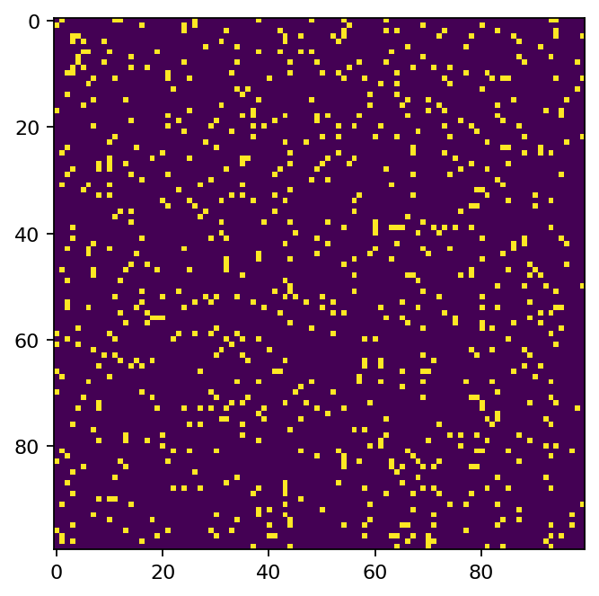
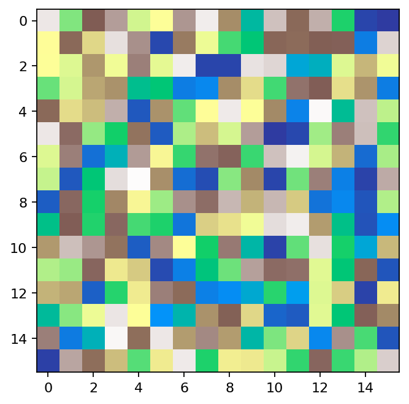

# fluvialgeomorphology




Archived Python prototypes for fluvial geomorphology-style grid simulations.

## What this project contains

This repo has two standalone simulation scripts:

- `src/1.py`: simple sediment transport cellular model
- `src/2.py`: rainfall, flow routing (D8), erosion/deposition terrain model

Both scripts use `matplotlib.animation` to visualize state over time.

## What you were doing (historical context)

Based on file timestamps:

1. `src/1.py` was last modified on `2023-03-16 23:01:06 +0900`
2. `src/2.py` was last modified on `2023-03-16 23:22:53 +0900`
3. Repo scaffolding (`uv init`) files were created on `2026-02-26 13:22 +0900`

Likely workflow:

1. quick prototype of random sediment movement (`src/1.py`)
2. expansion into a more physical terrain/water/erosion model (`src/2.py`)
3. later archive/restructure into `src/` and initialize with `uv`

## Setup with uv

From the project root:

```bash
uv sync
```

This creates `.venv` and installs project dependencies from `pyproject.toml`.

## Run the simulations

Run script 1:

```bash
uv run python src/1.py
```

Run script 2:

```bash
uv run python src/2.py
```

Named commands (shorter):

```bash
uv run fluvial-sim1
uv run fluvial-sim2
```

Notes:

- Both scripts open a matplotlib window and run an animation loop.
- `src/2.py` prints a frame counter each iteration.
- This repo pins Python `3.13.12` in `.python-version` because older uv-managed 3.13 builds can default to non-interactive matplotlib behavior.

## Current limitations (expected for prototype code)

- No package/module structure yet (just standalone scripts)
- No tests or reproducibility controls (seeded RNG, saved outputs)
- Numeric filenames (`1.py`, `2.py`) are fine for direct script execution but awkward for import-based tooling
